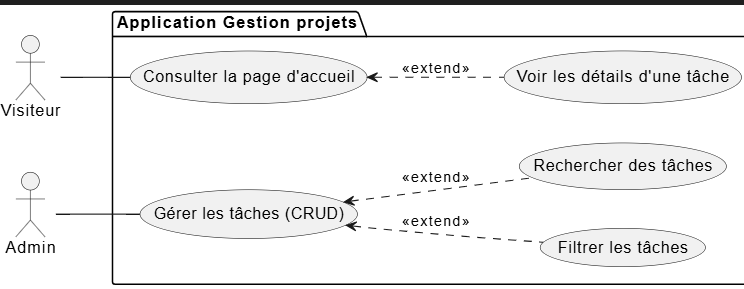

# Présentation Projet technique
### Application de gestion et filtrage des tâches
**Présentée par : Yousra Akajou**  
**Encadré par : M. Fouad Essarraj**  
**Date : 05/01/2026**

---

# Choix du sujet
**gestion des tâches**

# Contexte

# Analyse technique 
## Fonctionnalités Clés
- CRUD **Tâches**
- Details Tache
- Filtrer les tâches par **projet**

##  Stack Technique
- 1- **Base de données** : MySQL  
- 2- **Framework** : Laravel  
- 3- **Architecture N-tier** : Services
- 4- **Architecture** : MVC  
- 5- **Moteur de vues** : Blade  
- 6- **AJAX** : Actions dynamiques (filtrage, mise à jour du statut)  
- 7- **Upload d’images** : Images associées aux tâches  
- 8- **Laravel multilingue** : Support de plusieurs langues  
- 9- **Vite**
- 10- **Preline UI library**
- 11- **Lucide Library**

##  Base de Données

### Table `projects`
- id  
- title  
- description  
- timestamps  

### Table `tasks`
- id  
- title  
- description  
- image
- project_id (clé étrangère)  
- timestamps  

## 🔗 Relation
- Un **projet** possède plusieurs **tâches**  
- Une **tâche** appartient à un **projet**

# Fonctionnalitées 

