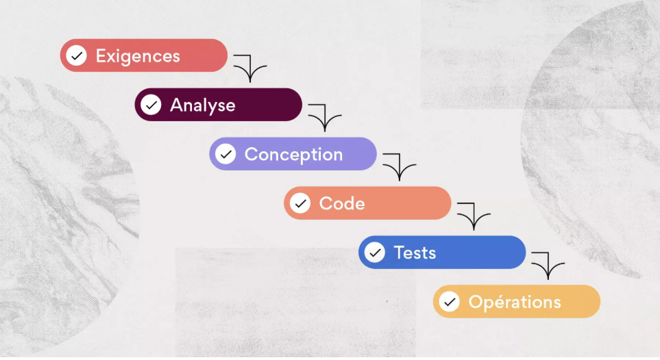

# Présentation Projet technique
### Application de gestion et filtrage des tâches
**Présentée par : Yousra Akajou**  
**Encadré par : M. Fouad Essarraj**  
**Date : 05/01/2026**

---
# Plan : 
**- Méthode Waterfall**
**- Exigences: Travail à faire**
**- Contexte: Projet de fin de formation**
**- Analyse technique**
**- Analyse : Analyse fonctionnelle**
**- Conception**
**- Versions**
**- Versions (v1 - v8)**
**- Conclusion**

---
# Méthode Waterfall

---
# Contexte

---
## Exigences: Travail à faire
### Développement d’une application de gestion de projets.

**Partie Publique :**
  - Affichage de la liste des tâches avec badge indiquant le projet correspondant
  - Consultation des détails d’une tâche

**Partie Admin :**
Tableau sécurisé dédié à la gestion des tâches.
  - Opérations CRUD sur les tâches
  - Recherche de tâches
  - Filtrage des tâches par projet

# Analyse technique 
## Fonctionnalités Clés
- CRUD **Tâches**
- Details Tache
- Filtrer les tâches par **projet**
- Rechercher les taches

##  Stack Technique
- 1- **Base de données** : MySQL  
- 2- **Framework** : Laravel  
- 3- **Architecture N-tier** : Services
- 4- **Architecture** : MVC  
- 5- **Moteur de vues** : Blade  
- 6- **AJAX** : Actions dynamiques (filtrage, mise à jour du statut)  
- 7- **Upload d’images** : Images associées aux tâches  
- 8- **Laravel multilingue** : Support de plusieurs langues  
- 9- **Vite**
- 10- **Preline UI library**
- 11- **Lucide Library**
- 12- **Alpine.js:** Librairie JavaScript pour les interactions dynamiques.

##  Base de Données

### Table `projects`
- id  
- title  
- description  
- timestamps  

### Table `tasks`
- id  
- title  
- description  
- image
- project_id (clé étrangère)  
- timestamps  

## 🔗 Relation
- Un **projet** possède plusieurs **tâches**  
- Une **tâche** appartient à un **projet**

# Fonctionnalitées 

# Conception

---

## Versions (v1 - v8)

| Version | Description | Branche |
| :--- | :--- | :--- |
| **v1** | Public Side (Consultation, Recherche, Filtre) | `public` |
| **v2** | Admin Side (CRUD, Modales) | `admin` |
| **v3** | Authentification / Authorization (Gates) | `gates` |
| **v4** | SPA / AJAX | `spa-ajax` |
| **v5** | SPA / Alpine.js | `spa-alpine` |
| **v6** | Spatie / Authorization | `spatie` |
| **v7** | API | `api` |
| **v8** | Mobile App | `mobile` |

---

<!-- Sujet de Live coding -->
# Sujet de Live coding
## **v1 : Public Side**  
*  **Live Coding :** Creation du portfolio personnel

---

## **v2 : Admin Side**
* **Live Coding:** Gestion des articles (CRUD)

---

## **v3 : Authentification / Authorization** 
* **Live Coding :**

---

## **v4 : SPA / AJAX** 
* **Live Coding :** 
  - Bouton “Ajouter” via modale
  - Barre de recherche dynamique

---

## **v5 : SPA / Alpine.js**
* **Live Coding :** 
---

## **v6 : Spatie / Authorization**
* **Live Coding :**

---

## **v7 : API** 
* **Live Coding :** 

---

## **v8 : Mobile App**
* **Live Coding :** 

---

## Conclusion